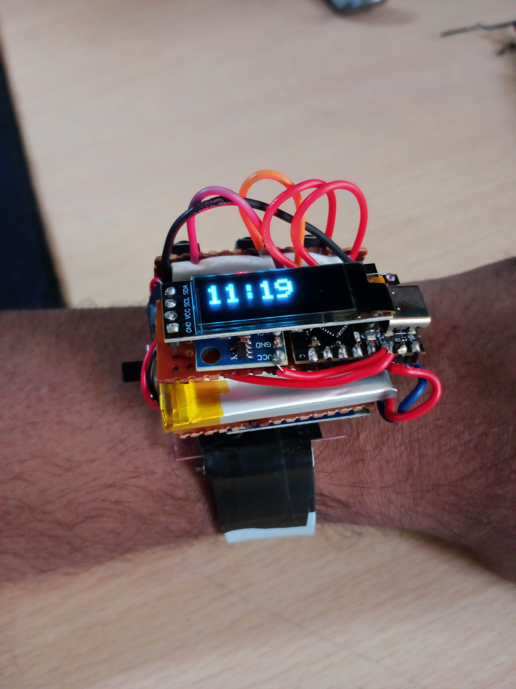
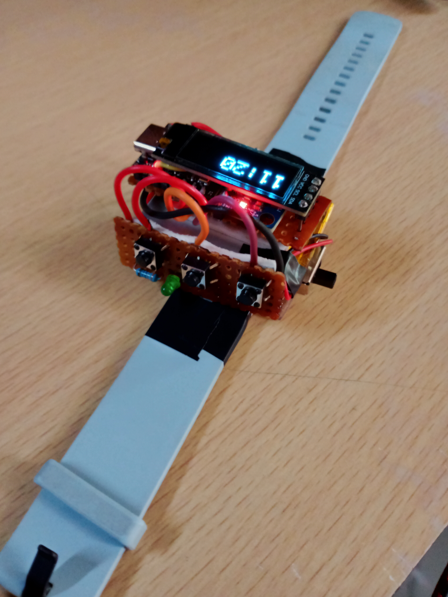

# VitalEdge

A MicroPython-based wearable health monitoring device built on the ESP32-C3, featuring real-time vitals tracking on a 128×32 OLED display.

<p align="center">
  
  
</p>

---

## Hardware

| Component | Interface | I2C Address | Pins |
|-----------|-----------|-------------|------|
| SSD1306 OLED (128×32) | I2C (hw) | `0x3C` | SCL=7, SDA=6 |
| MAX30102 HR/SpO₂ | SoftI2C | `0x57` | SCL=7, SDA=6 |
| MPU6050 IMU | I2C (hw) | `0x68` | SCL=7, SDA=6 |
| Button Next | GPIO INPUT_PULLUP | — | 21 |
| Button Select | GPIO INPUT_PULLUP | — | 20 |
| Button Action | GPIO INPUT_PULLUP | — | 10 |
| LED | GPIO OUTPUT | — | 9 |

---

## Power

The device is powered by a **3.7V 450mAh single-cell LiPo battery** connected through a dedicated **TP4056-based charging module**. This allows the battery to be charged in-circuit via the module's USB input without removing it from the device.

| Parameter | Value |
|-----------|-------|
| Battery chemistry | Li-Ion / LiPo (1S) |
| Nominal voltage | 3.7V |
| Capacity | 450 mAh |
| Charge voltage | 4.2V (CC/CV) |
| Charge current | 1C max (set by PROG resistor on TP4056) |
| Protection | Over-charge, over-discharge, short-circuit (via DW01A + FS8205A on module) |

An **AMS1117-3.3** LDO regulator sits between the battery output and the ESP32-C3's supply rail, stepping the LiPo voltage (3.7V nominal, 4.2V max) down to a stable 3.3V. The AMS1117 has a typical dropout voltage of ~1V, so regulation holds down to ~4.3V input — covering the full usable LiPo discharge range. The charging module's `CHRG` and `STDBY` indicator pins can optionally be wired to GPIO inputs for charge-state detection in firmware.

---

## Firmware Architecture

### `firmware/main.py` — Main Application

The firmware runs a single cooperative loop at ~1-second tick resolution using `time.ticks_ms()` for non-blocking timekeeping.

**UI State Machine:**

```
clock ──(Select)──► menu ──(Select: Set Time)──► set_time
                 │                                    │
                 ├──(Select: LED)──► toggle LED       └──(Select)──► clock
                 └──(Select: Stopwatch)──► stopwatch
```

**Modes:**

| Mode | Description |
|------|-------------|
| `clock` | Big-digit HH:MM display, 1Hz tick |
| `menu` | Scrollable 3-item menu via Next button |
| `set_time` | Increment hour/minute via Action button |
| `stopwatch` | 1Hz counter; Action = start/stop, Select = reset |
